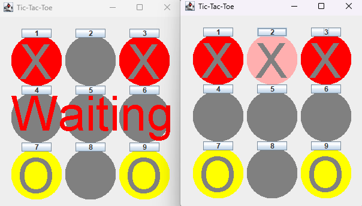

A java networked Tic-Tac-Toe game

This game uses a client / Server based architecture. The application protocol revolves around
sending and receiving the serialised GameData class. The client and server use TCP to
connect and communicate. When the client starts it connects to the Hole punch server (load balancer) to
get the IP of the game server. This project uses the built-in java cryptography libraries 
to encrypt the gamedata class. The program uses a secure handshake to make sure the keys are never exposed
and so they can be exchanged safely. The process of the entire program is as follows:

<ol>
<li> The server is initialised and generates the AES key that will be used for the session and waits for clients to connect</li>
<li> each client connects to the hole punch server once connected the server responds with the IP and port to the game server.
This acts like a load balancer</li>
<li> The client generates an RES key and connects to the game server. The client then sends the public key to the server.</li>
<li>The server receives the RES public key from the client and uses this key to encrypt
the AES session key. It then sends this encrypted message to the client.</li>
<li>The client receives the encrypted AES session key and decrypts it with the private
RES key. The client now finally has the AES key</li>
<li>Now that both clients can contact securely they now begin the game. The first client will be prompted
from the server and waiting for the clients move </li>
<li>The client sends its response to the server and the move is then sent to both clients so both are in sync.
The second client is then prompted for their response and this process is repeated until a player wins.</li>
</ol>
<h1>Example</h1>

<h1>Running</h1>
    <ul>
      <li>Compile the files</li>
      <li>Run run-holepunchserver.bat first</li>
     <li>Run run-server.bat second</li>
    <li>Then Run two instances of the client to play.</li>
  </ul>